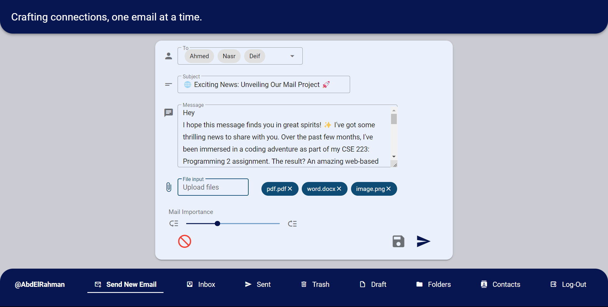
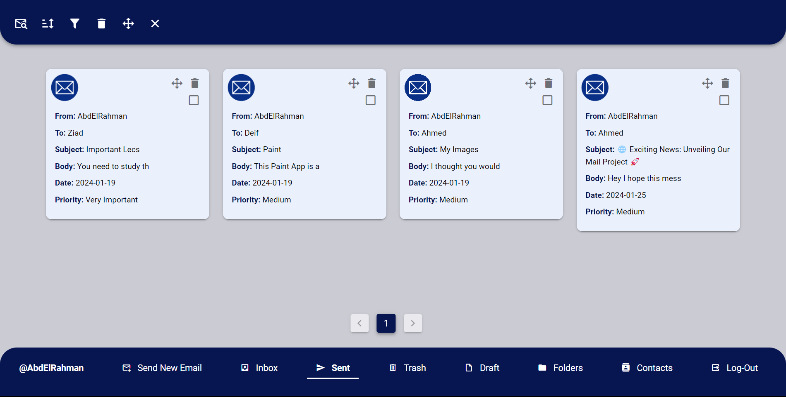
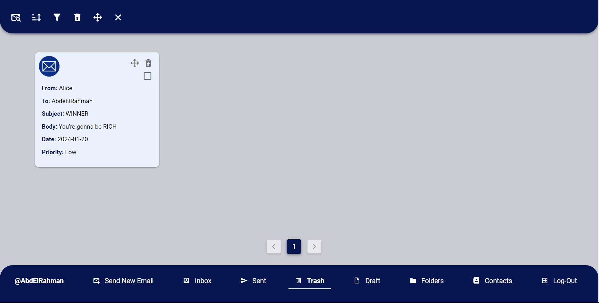
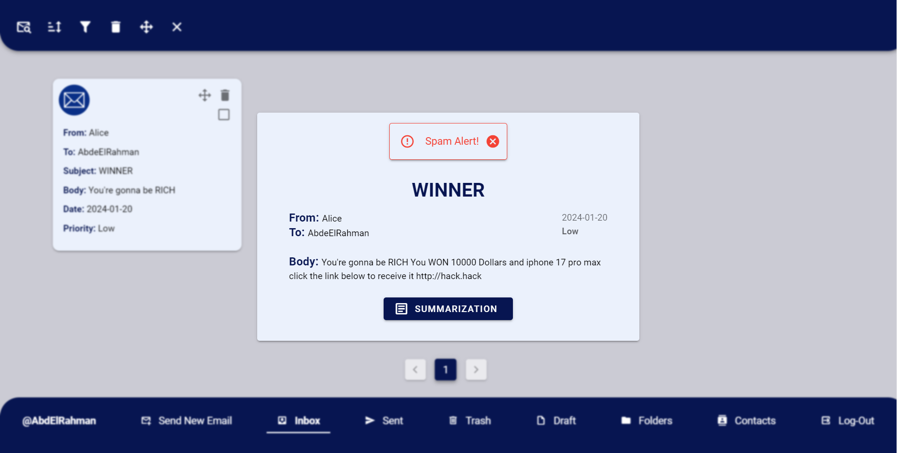
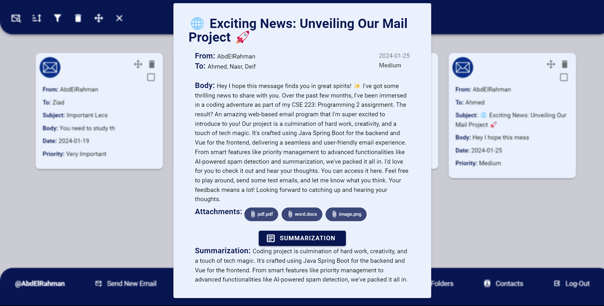
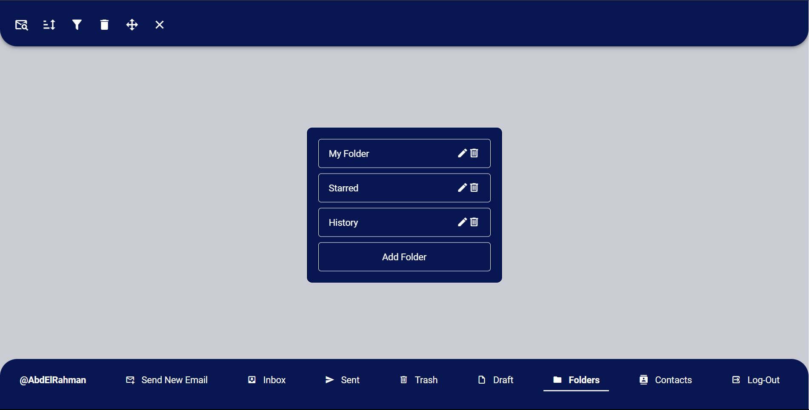
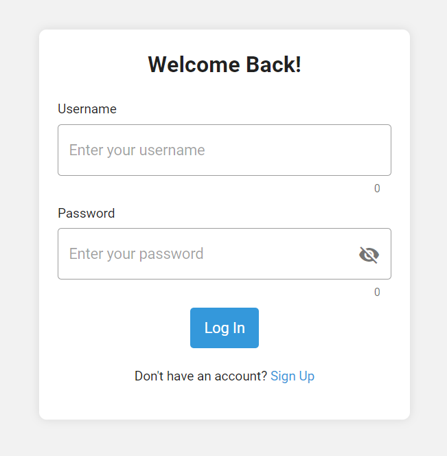
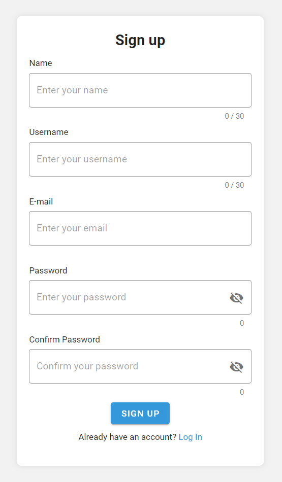

# Mail Server

This project involves the implementation of a feature-rich web-based email program. The application is developed using Java Spring Boot for the backend and Vue for the frontend, incorporating a variety of design patterns to ensure modularity, scalability, and maintainability.

---

## **Features:**

1. **Sending and Receiving Emails:**
    - Users can compose and send emails to one or multiple recipients.
    - Efficient mechanisms for receiving emails.
2. `**Attachments:**
    - Attach files to emails, supporting any file type.
    - Download attachments from received emails.
3. **Priority Management:**
    - Assign priorities (Very Important, Important, Medium, Low) to emails for better organization.
4. **Email Manipulation:**
    - Delete and retrieve individual emails.
    - Bulk delete and retrieve emails for efficient mailbox management.
    - Move emails between folders and perform bulk moves.
5. **Email Viewing and Interaction:**
    - View detailed content of an email.
    - AI-powered spam detection for enhanced email security.
    - AI-based summarization for quick insights into lengthy emails.
6. **Sorting and Filtering:**
    - Sort emails based on various attributes (Date, Sender, Importance, etc.).
    - Apply filters to categorize emails based on (subject, sender, etc.).
7. **Search Functionality:**
    - Search emails based on different criteria (Subject, Sender, Body, etc.).
8. **Pagination:**
    - Implement pagination for retrieving emails and contacts, ensuring smooth navigation.
9. **Folder Management:**
    - Create custom folders for better email organization.
    - Rename and delete folders as needed.
10. **Contact Management:**
    - Add new contacts with one or multiple email addresses.
    - Edit and delete existing contacts.
    - Efficient sorting and searching of contacts.
11. **Default Folders:**
    - Standard folders include Inbox, Sent, Draft, and Trash for a familiar email structure.
12. **User Authentication:**
    - Implement login and sign-up functionality to ensure secure user access.

---

## **Design Patterns Applied:**

- **Singleton Pattern:**
    - Implemented in managing critical components like email folders, ensuring a single instance throughout the application.
- **Factory Method Pattern:**
    - Utilized for creating instances of key elements such as email folders, contacts, and others, promoting flexibility and extensibility.
- **Concurrency Design Patterns:**
    - Applied for concurrent processing of emails, ensuring efficient handling of multiple operations simultaneously.
- **Builder Pattern:**
    - Implemented for the creation of complex email objects with attachments, providing a step-by-step construction process.
- **Facade Pattern:**
    - Employed to simplify complex subsystems, providing a unified interface for interacting with email-related functionalities.
- **Filter (Criteria) Pattern:**
    - Utilized for filtering and categorizing emails based on various criteria such as subject, sender, and importance.
- **Strategy Pattern:**
    - Applied in sorting algorithms for emails and contacts, allowing for flexibility and easy extension of sorting strategies.
- **Command Pattern:**
    - Used for encapsulating email-related operations like move, delete, and compose into command objects, providing a unified interface.
- **Proxy Pattern:**
    - Employed to control access to certain email functionalities, ensuring security and encapsulation.
- **Adapter Pattern:**
    - Implemented to enable compatibility and interaction between different components, ensuring seamless integration.

---

## **UML Class Diagram:**

This section provides a high-level overview of the Unified Modeling Language (UML) representation for the Drawing Application. UML diagrams serve as visual aids to understand the structural and behavioral aspects of the application's design.

---

## **UI Snapshots**

|  |  |
|:---:|:---:|